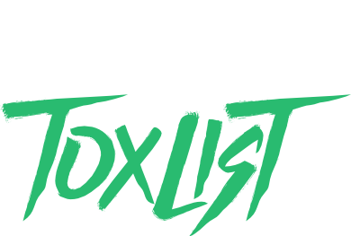

# 

**GTA Toxlist** is a curated index of toxic, modding, and griefer players encountered in **GTA 5 Online**.

This repository is designed both as a **GitHub project** and a **GitHub Pages website** that lists problematic accounts and behavior, helping players recognize bad‑behavior patterns and avoid unpleasant sessions.

> This project is **not official**, not affiliated with Rockstar Games, and not intended for revenge, doxxing, or harassment.

--- 

## 🧩 What this project is
**GTA Toxlist** is a **self‑made, community‑supportig index** that tracks:

- Players who show **toxic behavior** (insults, rage, constant trolling).
- Players who **use or appear to use mods** (mod menus, cheat tools).
- Players who bought **modded accounts** (lvl. 8000, Really High KD).
- Players who **have unfair advantages** (killing through walls with Thermal Vision, Out-of-Bounds).
- Known **griefers** (targeting players and killing them repeatedly, destroying cargo, disrupting missions, camping etc.).

This list is based on:
- **My own experiences** (marked with the **GTA Toxlist logo**).
- **Reports from other players** (marked with a different symbol).

Every entry stored here is treated as a **warning**, not as a verdict or permanent label.

---

## ⚠️ Ethical rules and boundaries

This project is explicitly **not** about:

- **Doxxing**: I never store or share real‑world personal data (addresses, phone numbers, private social accounts, etc.).
- **Harassment**: This list must not be used to organize raids, spam, or coordinated attacks.
- **Reputation killing**: Being listed does **not** mean someone is “evil forever.” It only reflects that there were **negative experiences** with that account.

If you notice an entry that:
- Exposes personal data (real name, address, phone number, private social accounts, etc.),
- Refers to your own account or any other innocent player without clear reason,
- Or seems outdated,

please open an issue so it can be reviewed or removed.

---

## 🧭 How the list works

The list is a **mixed collection** of two types of experiences:

### 1. My own experiences (GTA Toxlist‑logo )

- Marked with the **GTA Toxlist logo** () (or a similar symbol) in the index.
- These are incidents where **I personally witnessed** toxic, modding, or grievfing behavior.
- They are based on **direct in‑game encounters** I had.

### 2. Reports from other players (verified symbol )

- Marked with a **different symbol** (e.g., a verified checkmark).
- These are entries contributed by **other GTA Online players**.
- They **must** be based on **documented evidence** or clear, verifiable behavior (see *Proof & evidence* below).

All entries are stored in **separate files** like:

- `toxic.json` – Players with toxic behavior.
- `modding.json` – Accounts suspected of modding.
- `griefing.json` – Known griefers.

Each entry usually includes:

- In‑game name or handle.
- Platform (PS4/PS5, Xbox, PC).
- Short, factual description of the incident.
- Type of report (my own / from another player).
- Optional: timestamp or session context.

---

## 🌐 GitHub Pages website
This repository is linked to **GitHub Pages**, so the list is also available as a **Website**:

- URL: `https://gta-toxlist.github.io/`
- The site shows:
  - A clean index page.
  - Sections for toxic players, modding accounts, and griefers.
  - Distinct visual markers (e.g., icons or labels) for **my own experiences** vs. **reports from other players**.
  - A short explanation of the project’s rules and ethics.

This makes it easy to:

- Browse the list without cloning the repository.
- Share direct links to sections or specific entries.
- See which entries are based on **my own experience** and which are **community‑reported**.

---

## 🧑‍💻 How other players can contribute
Other players are allowed to **contribute** to the list, but **only under strict rules**:

### When can you contribute?

- You had an **in‑game encounter** with a player that involved:
  - Toxic behavior (insults, rage, constant trolling).
  - Suspected modding or modded‑account behavior.
  - Clear griefing (targeting and killing you repeatedly, destroying cargo, disrupting missions, camping etc.).
- You can **prove** or at least **document** the behavior (see *Proof & evidence*).

### How to contribute

1. **Open an Issue** in this repository:
   - Title: `Report: <Player Name> – <Behavior Type>`.
   - Body:
     - In‑game name and platform.
     - Date and time (approximate).
     - Short description of what happened.
     - Type of contribution (**“Evidence‑based report”**).
     - Any proof (screenshots, video links, etc.).

2. Alternatively, fork the repo and:
   - Add your entry to the correct file (`toxic.json`, `modding.json`, or `griefing.json`).
   - Mark it clearly (e.g., `[OTHER]` or with a symbol).
   - Open a Pull Request with a short description.

All contributions must be **clear, factual, and respectful**.

---

## 🧩 Proof & evidence
Contributions are **only accepted** if they include **some form of evidence** or strong indication of the behavior:

- **Screenshots** of in‑game chat or actions.
- **Video links** (e.g., YouTube, Twitch clips) showing the incident.
- **Timestamped logs** or detailed descriptions of the event (if no media is available).
- **Witness accounts** from other players (if possible).

Entries without any proof or with only hearsay will be **rejected or removed**.

---

## 🧭 Visual distinction in the list
To make the origin of each entry clear, the list uses **visual markers**:

- **My own experiences**:
  - Marked with the **GTA Toxlist logo** (or small icon).
  - These are the most trusted entries, as they are based on **direct observations** from me.
- **Reports from other players**:
  - Marked with a **different symbol** (verified checkmark).
  - These are treated as **community‑reports**, not as absolute proof.

This distinction helps users understand the **source of the information** and its reliability.

---

## 🧑‍💻 How the project is maintained

This project is kept **simple and minimal**:

- Written in **JSON** for easy editing and versioning.
- Hosted as **GitHub Pages** for a clean web view.
- No backend, no database, just static files.

This makes it:

- Fast to load.
- Easy to review changes.
- Suitable for small‑scale, personal tracking with community support.

---

## 📝 License and usage

You are free to:

- **Fork** this repository.
- **Copy** the structure.
- **Build** your own similar list.

However, please:

- **Do not copy** any personal data.
- **Do not use** this as a harassment tool.
- **Respect** the line between **warning** and **bullying**.
- **Respect** the proof‑requirement for contributions.

---

## 🤝 Feedback and questions

If you have questions, concerns, or ideas for improvement, feel free to:

- Open an **Issue** in this repository.
- Comment on the **GitHub Pages** page (if enabled).
- Or reach out via GitHub (depending on how you prefer to communicate).

This project lives and grows only with **responsible use**, **community awareness**, and **clear ethical guidelines**.